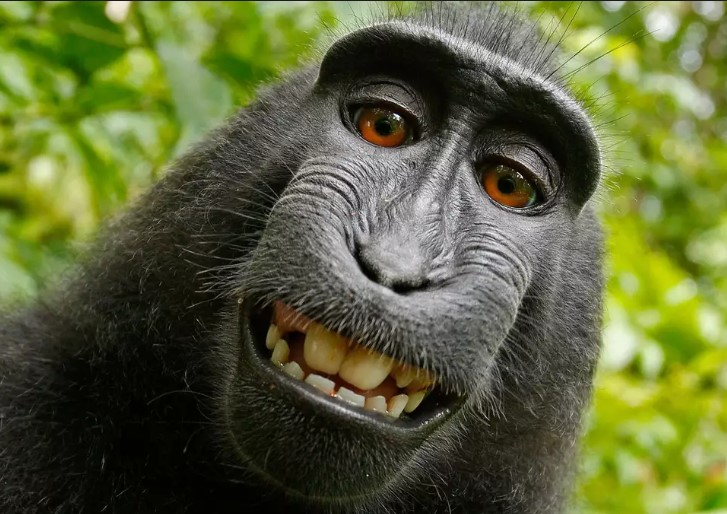
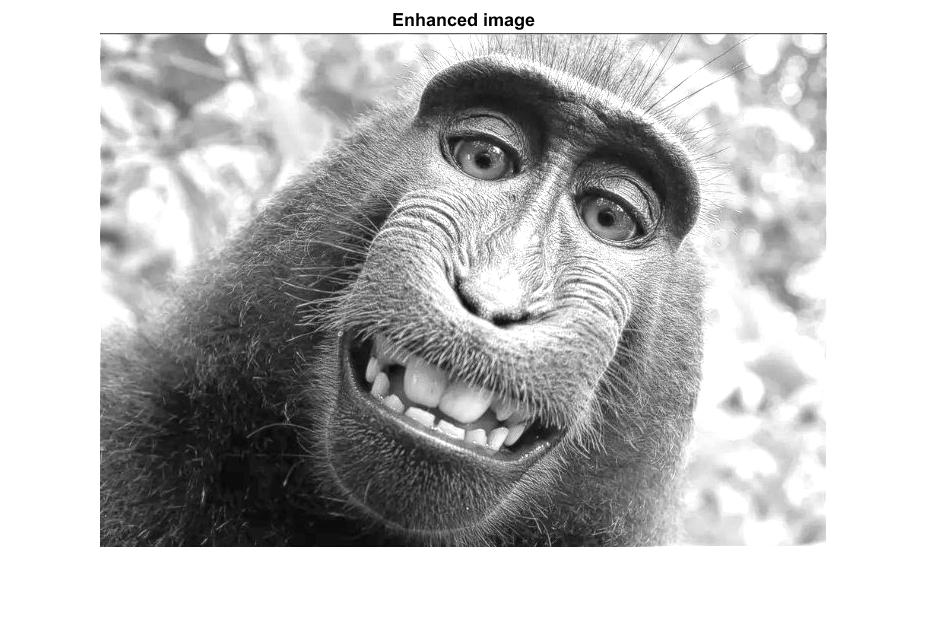
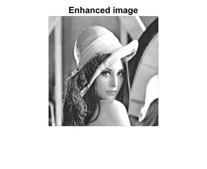

# PSO Image Enhancement

[](https://www.mathworks.com/products/matlab.html)
[](CHANGELOG.md)
[](LICENSE)

Reference-free grayscale image enhancement in MATLAB using Particle Swarm
Optimization (PSO). The optimizer searches for the parameters of a locally
adaptive contrast transform and balances detail, entropy, contrast, and
clipping.

Version 3.0 replaces the scalar surrogate used by the original experiment
with a genuine four-dimensional swarm. Each particle now represents
`[a, b, c, k]`, maintains its own best position, and contributes to a
reproducible global optimum.

## Examples

| Original | Enhanced |
|:--:|:--:|
|  |  |
|  |  |

The screenshots are retained benchmark outputs from this project's MATLAB
experiments. Exact version 3 results are reproducible with the fixed random
seed shown below and can vary when you select a different seed or objective.

## Requirements

- MATLAB R2018b or newer
- Image Processing Toolbox

The implementation is platform-independent and uses `fullfile` rather than
hard-coded path separators.

## Quick start

Clone the repository, make it the current MATLAB folder, and run:

```matlab
[enhanced, result] = mainPso();
```

To enhance your own image without opening figures:

```matlab
image = imread("my-image.jpg");
[enhanced, result] = psoEnhanceImage(image, ...
    "SwarmSize", 30, ...
    "MaxIterations", 75, ...
    "LocalWindowSize", 5, ...
    "RandomSeed", 42, ...
    "DisplayProgress", true);

imshow(enhanced);
disp(result.BestParameters);
```

On releases of MATLAB before string name-value syntax was introduced, use
single quotes instead.

## API

### `psoEnhanceImage`

```matlab
[enhancedImage, result] = psoEnhanceImage(inputImage, Name, Value)
```

`inputImage` may be grayscale or RGB. `enhancedImage` is a grayscale
double-precision image in `[0, 1]`.

| Option | Default | Meaning |
|---|---:|---|
| `SwarmSize` | `24` | Number of particles |
| `MaxIterations` | `50` | Optimization budget |
| `LocalWindowSize` | `3` | Odd local-statistics window size |
| `RandomSeed` | `42` | Seed used by MATLAB's `twister` generator |
| `StallIterations` | `12` | Stop after this many iterations without improvement |
| `DisplayProgress` | `false` | Print the best fitness per iteration |

The returned `result` struct contains the winning parameters and fitness,
fitness history, actual iteration count, seed, and resolved options.

### Transformation

For normalized intensity `I`, local mean `m`, local standard deviation
`sigma`, and global mean `M`, the transform is:

```text
E = (k M / (sigma + b)) (I - c m) + m^a
```

All candidates are saturated to `[0, 1]`. The optimizer maximizes a
no-reference objective composed of Sobel edge strength and density, entropy,
global contrast, and a penalty for clipped pixels.

## What changed in 3.0

- real four-dimensional PSO positions and velocities;
- personal-best and global-best tracking;
- per-particle, per-dimension random acceleration;
- bounded positions and velocity clamping;
- deterministic runs and stall-based early stopping;
- stable fitness calculation for flat images;
- correct local-window normalization for any supported window size;
- RGB/grayscale input handling and reusable function API;
- tests and a complete contributor/security documentation set.

See [CHANGELOG.md](CHANGELOG.md) for migration notes and
[docs/ALGORITHM.md](docs/ALGORITHM.md) for the design rationale.

## Testing

From the repository root:

```matlab
results = runtests("tests");
assertSuccess(results);
```

The test suite covers output bounds, determinism, custom options, flat-image
stability, and validation failures.

## Contributing and support

Bug reports and focused pull requests are welcome. Read
[CONTRIBUTING.md](CONTRIBUTING.md), [CODE_OF_CONDUCT.md](CODE_OF_CONDUCT.md),
and [SECURITY.md](SECURITY.md) before participating. For scientific use,
see [CITATION.cff](CITATION.cff).

## License

Released under the [MIT License](LICENSE).
