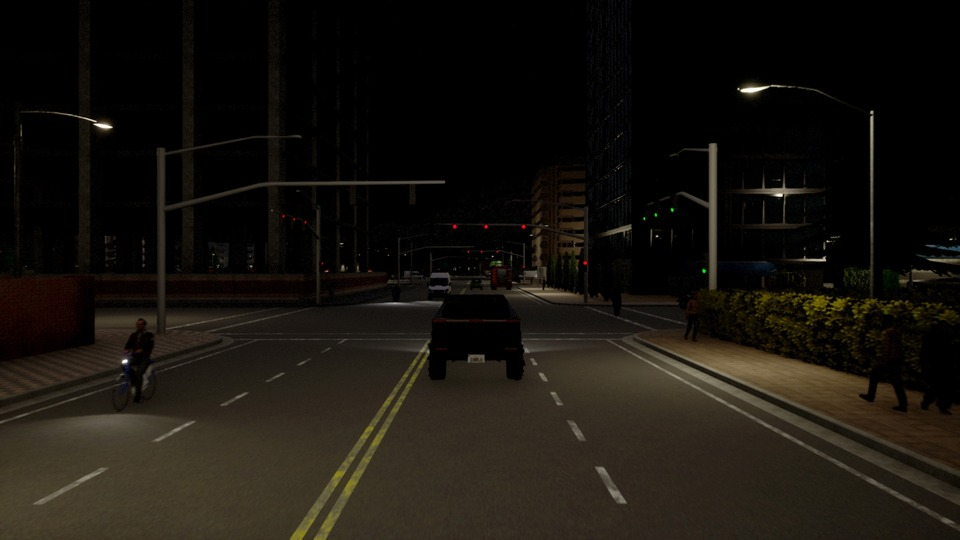
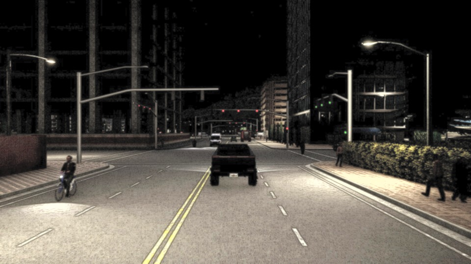
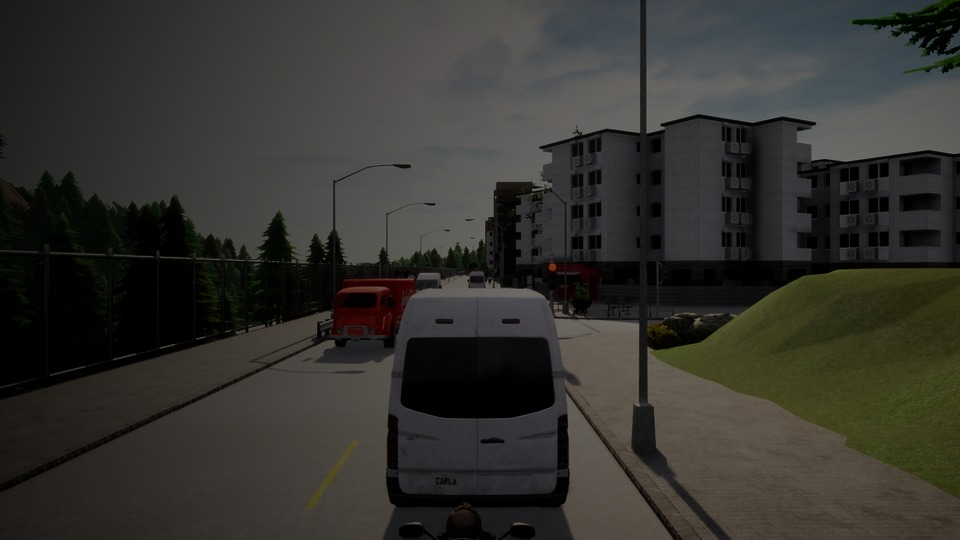
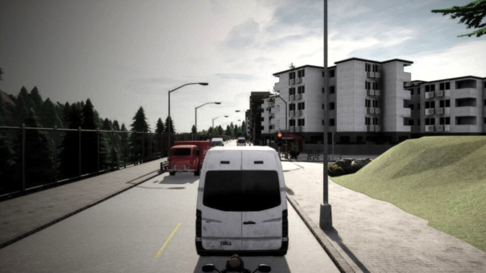

# PSO Image Enhancement

[](https://www.mathworks.com/products/matlab.html)
[](https://github.com/dleliuhin/PSO-Image-Enhancement/actions/workflows/matlab.yml)
[](CHANGELOG.md)
[](LICENSE)

A reproducible MATLAB research toolkit for reference-free image enhancement
with Particle Swarm Optimization (PSO). It supports grayscale and
color-luminance processing, weighted and Pareto objectives, multi-seed
benchmarks, standard baselines, and image-quality metrics.

## Autonomous-driving examples

| Input | Pareto PSO 3.1 |
|:--:|:--:|
|  |  |
|  |  |

The front-camera scenes come from the CC BY 4.0 CARLA–nuScenes dataset.
The second input is deterministically degraded from a retained reference.
See [sample attribution](examples/autonomous-driving/ATTRIBUTION.md) and
[benchmark methodology](docs/BENCHMARKING.md). Image assets are CC BY 4.0
and are not covered by the code's MIT license.

## Highlights

- true four-dimensional PSO over `[a, b, c, k]`;
- cached local statistics and reduced-resolution optimization;
- RGB enhancement in CIE Lab luminance with original chroma preservation;
- isolated `RandStream` without global RNG side effects;
- weighted-objective and bounded Pareto-archive modes;
- deterministic multi-seed benchmarking with mean and standard deviation;
- `imadjust`, histogram equalization, and CLAHE baselines;
- entropy, contrast, gradient, edge, clipping, fidelity, and optional
  no-reference IQA metrics;
- MATLAB unit tests, coverage, CI, and installable toolbox packaging.

## Requirements

- MATLAB R2024b for the tested configuration;
- Image Processing Toolbox.

Core enhancement remains compatible with earlier releases that provide
`rgb2lab`, `lab2rgb`, and `RandStream`. Toolbox packaging through
`buildToolbox` requires MATLAB R2023a or newer.

## Quick start

```matlab
image = imread("my-image.jpg");

[enhanced, result] = psoEnhanceImage(image, ...
    "ObjectiveMode", "pareto", ...
    "SwarmSize", 30, ...
    "MaxIterations", 75, ...
    "LocalWindowSize", 5, ...
    "OptimizationScale", 0.5, ...
    "RandomSeed", 42);

imshow(enhanced);
disp(result.BestParameters);
disp(result.ParetoFront.Objectives);
```

`psoEnhanceImage` is the compatibility entry point.
`psoenhance.enhance` is the namespaced research API.

## API options

| Option | Default | Meaning |
|---|---:|---|
| `SwarmSize` | `24` | number of particles |
| `MaxIterations` | `50` | maximum optimization iterations |
| `LocalWindowSize` | `3` | odd local-statistics window |
| `RandomSeed` | `42` | seed of the isolated local stream |
| `StallIterations` | `12` | early-stopping patience |
| `ColorMode` | `luminance` | preserve color or return grayscale |
| `ObjectiveMode` | `weighted` | `weighted` or `pareto` |
| `ObjectiveWeights` | `[.35 .25 .20 .20]` | detail, information, contrast, naturalness |
| `ArchiveSize` | `40` | maximum Pareto archive size |
| `OptimizationScale` | `0.5` | scale used during parameter search |
| `DisplayProgress` | `false` | print convergence progress |

The result struct contains the selected parameters, objectives, convergence
history, options, seed, and full nondominated archive.

## Reproducible benchmark

```matlab
[runs, summary] = runBenchmark( ...
    "Seeds", 1:10, ...
    "SwarmSize", 24, ...
    "MaxIterations", 50);
```

The benchmark compares the original input, `imadjust`, gamma correction,
`histeq`, CLAHE, weighted PSO, and Pareto PSO. It writes raw and summarized
CSV files under `benchmark-results/`.

The repository's compact CI benchmark uses five seeds, 16 particles, and
30 iterations. Stochastic results are reported as mean ± standard deviation.

<!-- BENCHMARK_TABLE_START -->
Benchmark results are generated by MATLAB CI and stored in
`benchmark-results/benchmark-summary.csv`.
<!-- BENCHMARK_TABLE_END -->

Metric directions are not interchangeable: entropy or gradient can increase
because of noise, while PSNR can penalize a useful contrast change. See
[docs/BENCHMARKING.md](docs/BENCHMARKING.md) for interpretation and
limitations.

## Package structure

```text
+psoenhance/
  enhance.m               optimizer and public research API
  precomputeStatistics.m  reusable image-dependent terms
  applyTransform.m        four-parameter local transform
  computeMetrics.m        benchmark and fidelity metrics
  updateArchive.m         bounded nondominated archive
  benchmark.m             baselines and multi-seed experiments
examples/
tests/
```

Legacy functions in `sources/` remain as compatibility wrappers.

## Testing and packaging

```matlab
results = runtests("tests");
assertSuccess(results);

toolboxFile = buildToolbox();
```

GitHub Actions runs tests, emits JUnit and Cobertura artifacts, executes the
compact research benchmark, and regenerates README images.

## Related research

1. [Kennedy & Eberhart, Particle Swarm Optimization, 1995](https://doi.org/10.1109/ICNN.1995.488968)
2. [Gorai & Ghosh, Gray-level Image Enhancement by PSO, 2009](https://doi.org/10.1109/NABIC.2009.5393603)
3. [Ye et al., Adaptive Image Enhancement with Cuckoo Search and PSO, 2015](https://doi.org/10.1155/2015/825398)
4. [Wan et al., PSO-based Local Entropy Weighted Histogram Equalization, 2018](https://doi.org/10.1016/j.infrared.2018.04.003)
5. [Zhang et al., Color Image Contrast Enhancement Based on Improved PSO, 2023](https://doi.org/10.1371/journal.pone.0274054)

Full citation notes and the relationship to this implementation are in
[docs/REFERENCES.md](docs/REFERENCES.md).

## Scientific-use note

This is a research implementation, not a safety-certified perception
component. Enhancement can amplify noise, alter photometry, or affect
downstream detectors. Autonomous-driving, medical, scientific, and forensic
applications require domain-specific validation.

## Contributing, citation, and license

Read [CONTRIBUTING.md](CONTRIBUTING.md),
[CODE_OF_CONDUCT.md](CODE_OF_CONDUCT.md), and [SECURITY.md](SECURITY.md).
Citation metadata is available in [CITATION.cff](CITATION.cff).

MATLAB source code is released under the [MIT License](LICENSE). The
autonomous-driving example images and derivatives are separately licensed
under CC BY 4.0.
